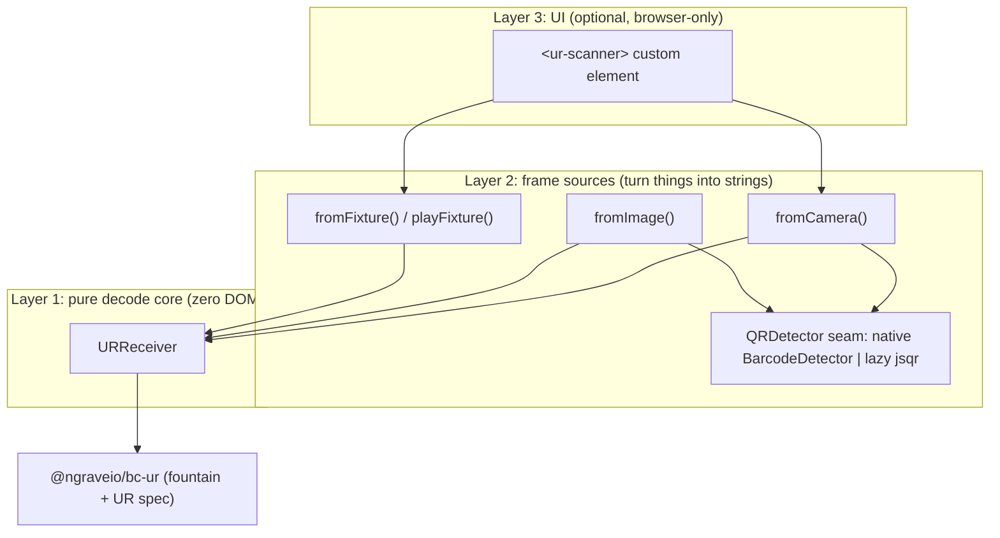

# Architecture: three layers, strictly separated

The library is three layers, and the separation is deliberate: it is what lets the decode core be tested without a browser, the camera code be swapped for a fixture, and the UI be optional. Understanding the split tells you exactly which layer to reach for.

## Layer 1: `URReceiver`, the pure decode core

Zero DOM, zero network. It consumes strings (`addPart(text)`) and produces `Progress` snapshots plus `complete` / `error` / `ignore` events. It owns everything that is *policy* rather than *math*:

- **type locking and mixed-type detection**: the first accepted part locks the UR type; a later part of a different type is surfaced as a non-fatal `MIXED_UR_TYPES` warning and ignored, so pointing the camera at an unrelated QR mid-scan does not corrupt the result.
- **the `expectedType` filter**: reject a type you did not ask for up front.
- **idempotent duplicate handling**: re-seeing a frame is a no-op for progress and emits an `ignore` with reason `duplicate`.
- **honest progress semantics**: `estimatedPercent` comes from the decoder, not from `received / expected`, because fountain progress is not linear (see [fountain codes](fountain-codes.md)).
- **an optional stall watchdog** (`stallTimeoutMs`), off by default so the core stays deterministic.

What it does **not** own: the fountain math and UR parsing. Those belong upstream in `@ngraveio/bc-ur` and we do not reimplement the spec.

## Layer 2: frame sources, which turn the world into strings

Each source's only job is to produce strings and hand them to a `URReceiver`.

- **`fromCamera`** opens a `getUserMedia` stream, draws frames to an offscreen canvas on a throttled loop, and runs the detector. Returns a controller (`stop`, `torch`, `listVideoInputs`, `switchCamera`).
- **`fromImage`** paints one still (a `Blob`, `File`, `ImageBitmap`, ``, or URL) to a canvas and detects every code in it: the no-camera path for screenshots and uploads.
- **`fromFixture` / `playFixture`** feed a known `string[]`: the camera-free path for tests, CI, and the demo's one-device mode.

The **`QRDetector` seam** decouples "pixels to strings" from any specific engine. Resolution order is explicit-then-native-then-lazy-fallback: a detector you pass wins (tests inject a stub), otherwise the native `BarcodeDetector`, otherwise a dynamically `import()`ed `jsqr`. Keeping `jsqr` lazy is what keeps the core dependency-light.

## Layer 3: `<ur-scanner>`, the optional UI

A framework-agnostic custom element wrapping layers 1 and 2: a video preview, an SVG progress ring, a camera picker, a torch toggle, and an `aria-live` region. It emits DOM `CustomEvent`s (`ur-progress`, `ur-complete`, `ur-error`, `ur-ignore`) and exposes CSS `::part()`s. It lives behind the browser-only `@blocco/ur-scanner/element` subpath so importing the core never drags in `HTMLElement` (the SSR gotcha, see [frameworks](../howto/frameworks.md)).

## What belongs here vs upstream in bc-ur

| Concern | Owner |
| --- | --- |
| UR string format, CBOR, bytewords | `@ngraveio/bc-ur` |
| Fountain encoding/decoding, checksums | `@ngraveio/bc-ur` |
| Camera, canvas, detector seam | this library |
| Decode loop, progress policy, type locking, dedupe | this library |
| Web component, events, a11y | this library |
| Registry types (`crypto-hdkey`, ...) | your app + a registry lib |

If you find yourself wanting to change how a part string is parsed or how fragments are mixed, that is a bc-ur concern, not this library's.
