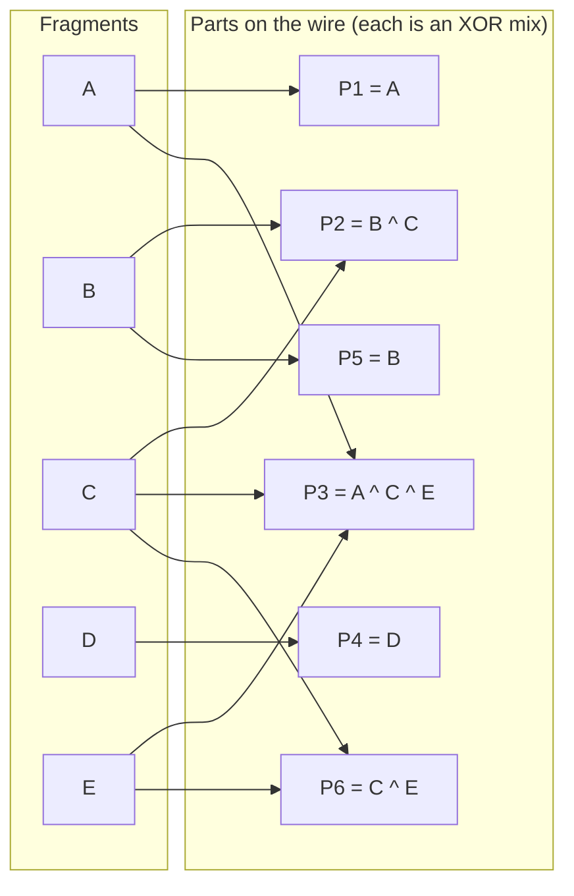

# Fountain codes, or why you never wait for frame 7 of 12

This is the idea that makes animated QR usable in the real world. It is worth ten minutes even if you never touch the code, so this page is written to be read (and shared) on its own.

## Glossary

Used identically across all the docs:

- **UR**: a Uniform Resource, the whole self-describing payload (`ur:bytes/...`).
- **fragment**: one slice of the payload after the encoder splits it. There are a fixed number of them, call it *K*. Also called a **source part**.
- **part**: one animated frame, the thing in one QR image. A part carries either a single fragment or an XOR mix of several. The stream of parts is infinite.
- **sequence**: the ordered fragments `1..K` that together are the payload.

## The problem with counting

The obvious way to send a big payload as animated QR is to chop it into numbered chunks and loop:

```
frame 1 of 12, frame 2 of 12, ... frame 12 of 12, frame 1 of 12, ...
```

The receiver collects `1..12` and reassembles. This is exactly what the naive protocol in this repo's parent app did (`src/lib/transport/pacchetto.ts`, `chunkPerQr` / `riassembla`), and it works until a camera misses a frame, which a camera always does. Miss frame 7 and you wait a whole loop for it to come round again. Miss it again (glare, hand shake, a slow frame) and you wait another loop. Under real frame loss the tail frames become a coupon-collector lottery and the scan drags or stalls.

Fountain codes delete the counting.

## The trick: send mixtures, not chunks

A **fountain code** is *rateless*: from *K* fragments it can generate an unlimited stream of parts, and the receiver reconstructs the payload once it has collected *any* set of parts whose information adds up to the original, typically a little more than *K* parts. No part is special. No part must arrive. You can start recording at any frame. This is why the progress API here reports `canStartAnywhere: true`.

Each part is the XOR of a pseudo-randomly chosen subset of fragments. XOR is its own inverse, so if you know all but one fragment in a mixture, you recover the missing one by XOR-ing the rest back out. Recovery is a cascade: every fragment you solve unlocks others.

### A worked example with 5 fragments

Payload split into fragments `A B C D E` (*K* = 5). The encoder emits parts like this (real fountain schemes bias toward small mixtures; this is illustrative):



Now watch the receiver, and note that **P1 never arrives** (the camera missed it) yet we still finish:

| Step | Part seen | Known after XOR cascade |
| --- | --- | --- |
| 1 | `P4 = D` | `D` |
| 2 | `P5 = B` | `B D` |
| 3 | `P2 = B ^ C` | solve `C = P2 ^ B` -> `B C D` |
| 4 | `P6 = C ^ E` | solve `E = P6 ^ C` -> `B C D E` |
| 5 | `P3 = A ^ C ^ E` | solve `A = P3 ^ C ^ E` -> `A B C D E` done |

Five parts arrived, out of order, with the "first" part lost, and the payload is whole. That is the entire magic. Blockchain Commons' scheme (which `@ngraveio/bc-ur` implements, and which this library consumes) is a refined version of this with a proper degree distribution and a checksum so it knows when it is genuinely done.

## The punchline: sequential vs fountain under 40% loss

Split a payload into *K* = 12 fragments and drop 40% of frames at random (a realistic cameras-in-the-wild rate: glare, motion blur, the display and camera running at beating frame rates).

| | Sequential "N of 12" | Fountain-coded UR |
| --- | --- | --- |
| Frames needed to finish | all 12 distinct, in a lottery | ~13 to 15 *any* parts |
| Effect of a dropped frame | wait a full loop for it to repeat | irrelevant, the next part carries new information |
| Worst case | unbounded (coupon collector on the last few) | bounded, a small constant over *K* |
| Can start mid-stream | no, must catch every index | yes |
| Time to scan (subjective) | drags, occasionally stalls | steady fill, then done |

Under loss, sequential chunking's expected time to collect the last few distinct frames blows up (the classic coupon-collector tail), while a fountain decoder just keeps ingesting fresh mixtures and crosses the finish line a hair after *K*. That is why this library exposes `estimatedPercent` from the decoder rather than a naive `received / total`: honest fountain progress is not linear, and pretending otherwise would lie to the user near the end.

## Credits and further reading

- divan, [Fountain codes and animated QR](https://divan.dev/posts/fountaincodes/): the clearest visual walkthrough of the idea; this page owes it a great deal.
- Blockchain Commons, [Animated QRs / Uniform Resources](https://developer.blockchaincommons.com/ur/): the UR spec, the multipart format, and the reference behavior.
- The decoding is done by [`@ngraveio/bc-ur`](https://github.com/ngraveio/bc-ur); this library owns the frame sources, the decode loop, progress semantics, and the UI, not the fountain math. See [architecture](architecture.md).
