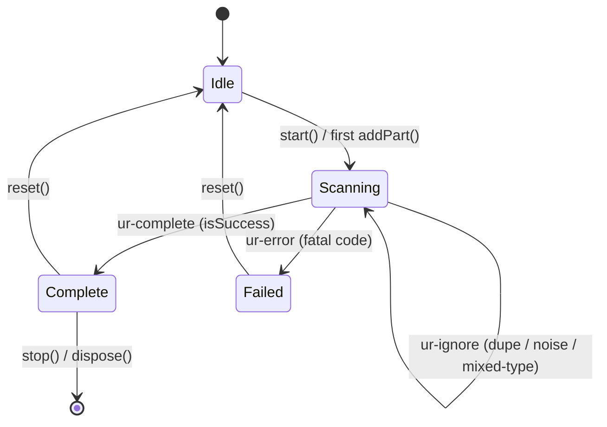

# API reference

Every public export, the `<ur-scanner>` surface, and the complete error taxonomy. Types are the source of truth; this mirrors them.

## Entry points

| Import | What | DOM-safe? |
| --- | --- | --- |
| `@blocco/ur-scanner` | core + frame sources + detector seam | yes (safe in SSR bundles) |
| `@blocco/ur-scanner/element` | side-effectful: registers `<ur-scanner>` | no (browser only) |

## `class URReceiver`

The pure decode core. `new URReceiver(options?)`.

### `URReceiverOptions`

| Option | Type | Default | Notes |
| --- | --- | --- | --- |
| `expectedType` | `string` | none | Reject any part whose UR type differs (case-insensitive). Emits `UNEXPECTED_TYPE`. |
| `stallTimeoutMs` | `number` | off | Emit `DECODE_STALL` if no *new* part arrives in this window while incomplete. |
| `onProgress` | `(p: Progress) => void` | | Convenience for `on('progress', ...)`. |
| `onComplete` | `(r: DecodedUR) => void` | | |
| `onError` | `(e: URScannerError) => void` | | |
| `onIgnore` | `(i: IgnoredFrame) => void` | | |

### Methods and properties

| Member | Signature | Notes |
| --- | --- | --- |
| `addPart` | `(text: string) => Progress` | Feed one scanned string. Idempotent; safe with noise. Returns progress after this frame. |
| `progress` | `Progress` (getter) | Current snapshot without feeding. |
| `isComplete` | `boolean` (getter) | |
| `type` | `string \| null` (getter) | Locked UR type, or `null` before the first accepted part. |
| `on` | `(event, listener) => () => void` | Returns an unsubscribe function. Events: `progress`, `complete`, `error`, `ignore`. |
| `off` | `(event, listener) => void` | |
| `reset` | `() => void` | Discard all state to start a fresh scan. |
| `dispose` | `() => void` | Clear the stall timer and all listeners. |

### `Progress`

```ts
interface Progress {
  type: string | null;          // locked UR type
  receivedParts: number;        // distinct source fragments recovered
  expectedPartCount: number;    // K; 0 until the first well-formed part
  estimatedPercent: number;     // 0..1 from the decoder, NOT received/expected
  framesSeen: number;           // every raw frame fed, incl. dupes and noise
  canStartAnywhere: true;       // a fact about fountain codes
  complete: boolean;
}
```

### `DecodedUR` (delivered on completion)

```ts
interface DecodedUR {
  type: string;                 // e.g. 'bytes', 'crypto-hdkey'
  cbor: Uint8Array;             // the raw UR body (CBOR), always present
  wasSinglePart: boolean;       // true => a static QR would have done; not an error
  decodeCbor(): unknown;        // CBOR-decoded value; for ur:bytes this is your payload bytes
}
```

### `IgnoredFrame`

```ts
interface IgnoredFrame {
  reason: 'not-a-ur' | 'mixed-type' | 'malformed' | 'duplicate';
  text: string;                 // truncated
  seenType?: string;            // when reason is 'mixed-type'
}
```

## Frame sources

### `fromCamera(options?): Promise<CameraController>`

`CameraSourceOptions` extends `URReceiverOptions` with: `video?: HTMLVideoElement`, `constraints?: MediaStreamConstraints` (default `{ video: { facingMode: 'environment' } }`), `receiver?: URReceiver`, `detector?: QRDetector`, `scanIntervalMs?: number` (default 120).

`CameraController`: `receiver`, `video`, `stop()`, `hasTorch()`, `torch(on)`, `listVideoInputs()`, `switchCamera(deviceId)`. See [camera selection and torch](howto/camera-selection-and-torch.md).

### `fromImage(source, options?): Promise<{ receiver, progress, found }>`

`source`: `Blob | File | ImageBitmap | HTMLImageElement | HTMLCanvasElement | string(url)`. Decodes every QR in one still and feeds them. Thread a `receiver` across calls for multi-part uploads. See [file and image input](howto/file-and-image-input.md).

### `fromFixture(parts, options?): { receiver, progress }`

Feed a `string[]` synchronously. `playFixture(parts, { intervalMs, loop, onFrame, ... })` plays them on a timer and returns `{ receiver, stop, done }`. Test utilities: `dropFraction(parts, fraction, seed?)` and `shuffle(parts, seed?)` (both deterministic). See [testing without a camera](howto/testing.md).

## Detector seam

- `nativeDetector(): QRDetector | null` : native `BarcodeDetector`, or `null` if absent.
- `fallbackDetector(): Promise<QRDetector>` : lazily `import()`s `jsqr`; throws `DETECTOR_UNSUPPORTED` if not installed.
- `resolveDetector(explicit?): Promise<QRDetector>` : explicit, then native, then fallback.
- `interface QRDetector { detect(canvas: HTMLCanvasElement): Promise<DetectedCode[]> }` and `interface DetectedCode { rawValue: string }`.

## `<ur-scanner>` custom element

Register with `import '@blocco/ur-scanner/element'` (or call `defineURScanner(tag?)`).

### Attributes

| Attribute | Values | Notes |
| --- | --- | --- |
| `auto-start` | boolean (presence) | Start on connect. |
| `expected-type` | string | Forwarded to the receiver. |
| `facing-mode` | `environment` \| `user` | Camera preference. |
| `scan-interval` | number (ms) | Detect throttle. |
| `fixture` | JSON `string[]` | One-device / demo mode: play these parts instead of the camera. |

### Methods, events, CSS parts

- **Methods**: `start()`, `stop()`, `reset()`.
- **Events** (bubbling, composed `CustomEvent`s): `ur-progress` (detail `Progress`), `ur-complete` (detail `DecodedUR`), `ur-error` (detail `URScannerError`), `ur-ignore` (detail `IgnoredFrame`).
- **CSS parts**: `container`, `video`, `overlay`, `ring`, `status`, `controls`, `camera-select`, `torch-button`. Style the ring fill via `::part(ring)` descendants; the accent stroke is a plain SVG you can override.

## Error taxonomy

Every failure is a `URScannerError` with a stable `code`. Branch on `code`, never on `message`.

| `code` | Layer | Trigger | Fatal? | Suggested user copy |
| --- | --- | --- | --- | --- |
| `INSECURE_CONTEXT` | camera | page served over plain HTTP | yes | "Camera needs a secure (HTTPS) page." |
| `CAMERA_UNSUPPORTED` | camera | no `getUserMedia` | yes | "This browser cannot open the camera. Upload a photo instead." |
| `CAMERA_PERMISSION_DENIED` | camera | `NotAllowedError` | yes | "Camera permission was denied. Enable it in site settings." |
| `CAMERA_NOT_FOUND` | camera | `NotFoundError` / `OverconstrainedError` | yes | "No camera found." |
| `DETECTOR_UNSUPPORTED` | detector | no native detector and `jsqr` missing | yes | "Install the QR fallback, or use a Chromium browser." |
| `UNEXPECTED_TYPE` | core | first part's type != `expectedType` | yes (rejects) | "That is not the code we expected." |
| `MIXED_UR_TYPES` | core | a foreign UR type appears mid-scan | no (warns, keeps going) | usually silent; keep scanning the right code |
| `DECODE_STALL` | core | no new part within `stallTimeoutMs` | no (informational) | "Not receiving frames. Move closer / clean the lens." |
| `DECODE_FAILED` | core | decoder reports an unrecoverable stream error | yes | "That code stream could not be decoded." |

Two related non-errors, documented here because people look for them:

- **Single-part UR**: not an error. The scan completes and `DecodedUR.wasSinglePart` is `true`, meaning the payload fit in one static QR and animation was unnecessary. Surface it as a hint if you like.
- **Non-UR noise** (a URL, a Wi-Fi QR): not an error either. It is counted in `framesSeen` and reported via the `ignore` event with reason `not-a-ur`, so the scanner shrugs off unrelated codes instead of failing.

## Event lifecycle


